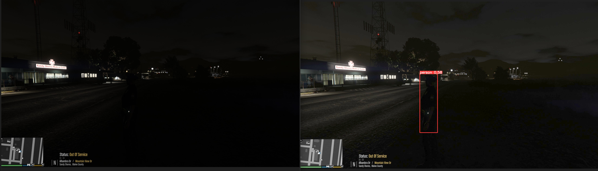
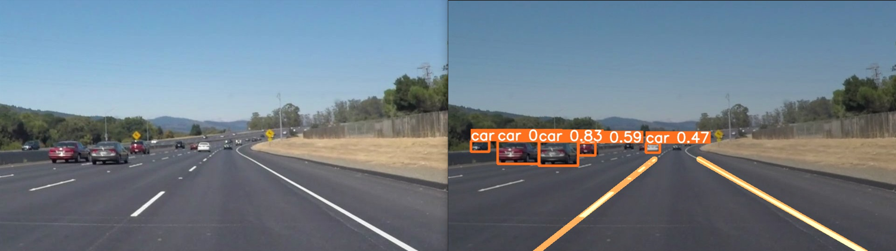
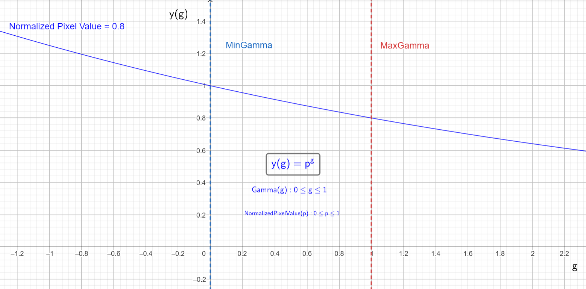
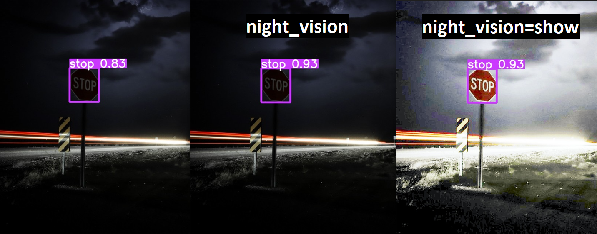
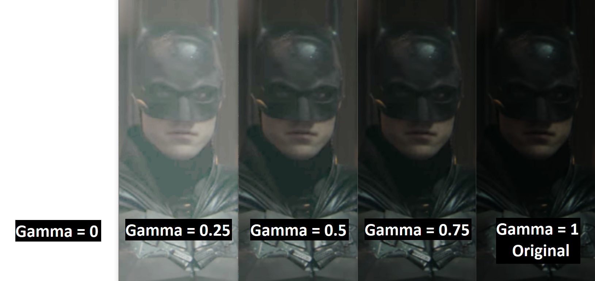

<div align="center">
  <p>
    <a href="https://ultralytics.com/yolov8" target="_blank">
      </a>
  </p>

# YOLOv8: Extended Edition

## 📘 Summary

🚀 [YOLOv8: Extended Edition](README.md) is a fork of [Ultralytics YOLOv8](https://github.com/ultralytics/ultralytics) repository. but with new features focuses on Automotive Vechicles 🚗.

</div>

> 🙋‍♂️ **Who are we ?** : 
> - We are a team from Egypt studied at [Faculty of Engineering](https://engfac.mans.edu.eg/), [Electronics and Communications Department](https://www.facebook.com/people/%D8%A7%D9%84%D8%B5%D9%81%D8%AD%D8%A9-%D8%A7%D9%84%D8%B1%D8%B3%D9%85%D9%8A%D8%A9-%D9%84%D9%82%D8%B3%D9%85-%D9%87%D9%86%D8%AF%D8%B3%D8%A9-%D8%A7%D9%84%D8%A7%D9%84%D9%83%D8%AA%D8%B1%D9%88%D9%86%D9%8A%D8%A7%D8%AA-%D9%88-%D8%A7%D9%84%D8%A7%D8%AA%D8%B5%D8%A7%D9%84%D8%A7%D8%AA-%D8%AC%D8%A7%D9%85%D8%B9%D8%A9-%D8%A7%D9%84%D9%85%D9%86%D8%B5%D9%88%D8%B1%D8%A9/100057482558089/) in [Mansoura University](https://www.mans.edu.eg/en).
>
> - These features were created to be used for our graduation project 🎓 (RTSD System) to make a system that can detect Roads Traffic Signs in real-time. 
>
> - We are using YOLOv8 as a base model and we are adding new features to it to make it more suitable for our use case.
>

If you are new to YOLOv8, please unpack the [original YOLOv8 Readme](#original-yolov8-readme) below.

<details>
<summary>Original YOLOv8 Readme</summary>

<div align="center">
  <p>
    <a href="https://ultralytics.com/yolov8" target="_blank">
      </a>
  </p>

[English](README.md) | [简体中文](README.zh-CN.md)
<br>

<div>
    <a href="https://github.com/ultralytics/ultralytics/actions/workflows/ci.yaml"></a>
    <a href="https://zenodo.org/badge/latestdoi/264818686"></a>
    <a href="https://hub.docker.com/r/ultralytics/ultralytics"></a>
    <br>
    <a href="https://console.paperspace.com/github/ultralytics/ultralytics"></a>
    <a href="https://colab.research.google.com/github/ultralytics/ultralytics/blob/main/examples/tutorial.ipynb"></a>
    <a href="https://www.kaggle.com/ultralytics/yolov8"></a>
  </div>
  <br>

[Ultralytics](https://ultralytics.com) [YOLOv8](https://github.com/ultralytics/ultralytics) is a cutting-edge, state-of-the-art (SOTA) model that builds upon the success of previous YOLO versions and introduces new features and improvements to further boost performance and flexibility. YOLOv8 is designed to be fast, accurate, and easy to use, making it an excellent choice for a wide range of object detection and tracking, instance segmentation, image classification and pose estimation tasks.

We hope that the resources here will help you get the most out of YOLOv8. Please browse the YOLOv8 <a href="https://docs.ultralytics.com/">Docs</a> for details, raise an issue on <a href="https://github.com/ultralytics/ultralytics/issues/new/choose">GitHub</a> for support, and join our <a href="https://discord.gg/n6cFeSPZdD">Discord</a> community for questions and discussions!

To request an Enterprise License please complete the form at [Ultralytics Licensing](https://ultralytics.com/license).

</a>

<div align="center">
  <a href="https://github.com/ultralytics" style="text-decoration:none;">
    </a>
  
  <a href="https://www.linkedin.com/company/ultralytics" style="text-decoration:none;">
    </a>
  
  <a href="https://twitter.com/ultralytics" style="text-decoration:none;">
    </a>
  
  <a href="https://youtube.com/ultralytics" style="text-decoration:none;">
    </a>
  
  <a href="https://www.tiktok.com/@ultralytics" style="text-decoration:none;">
    </a>
  
  <a href="https://www.instagram.com/ultralytics/" style="text-decoration:none;">
    </a>
  
  <a href="https://discord.gg/n6cFeSPZdD" style="text-decoration:none;">
    </a>
</div>
</div>

## <div align="center">Documentation</div>

See below for a quickstart installation and usage example, and see the [YOLOv8 Docs](https://docs.ultralytics.com) for full documentation on training, validation, prediction and deployment.

<details open>
<summary>Install</summary>

Pip install the ultralytics package including all [requirements](https://github.com/ultralytics/ultralytics/blob/main/requirements.txt) in a [**Python>=3.7**](https://www.python.org/) environment with [**PyTorch>=1.7**](https://pytorch.org/get-started/locally/).

```bash
pip install ultralytics
```

</details>

<details open>
<summary>Usage</summary>

#### CLI

YOLOv8 may be used directly in the Command Line Interface (CLI) with a `yolo` command:

```bash
yolo predict model=yolov8n.pt source='https://ultralytics.com/images/bus.jpg'
```

`yolo` can be used for a variety of tasks and modes and accepts additional arguments, i.e. `imgsz=640`. See the YOLOv8 [CLI Docs](https://docs.ultralytics.com/usage/cli) for examples.

#### Python

YOLOv8 may also be used directly in a Python environment, and accepts the same [arguments](https://docs.ultralytics.com/usage/cfg/) as in the CLI example above:

```python
from ultralytics import YOLO

# Load a model
model = YOLO("yolov8n.yaml")  # build a new model from scratch
model = YOLO("yolov8n.pt")  # load a pretrained model (recommended for training)

# Use the model
model.train(data="coco128.yaml", epochs=3)  # train the model
metrics = model.val()  # evaluate model performance on the validation set
results = model("https://ultralytics.com/images/bus.jpg")  # predict on an image
success = model.export(format="onnx")  # export the model to ONNX format
```

[Models](https://github.com/ultralytics/ultralytics/tree/main/ultralytics/models) download automatically from the latest Ultralytics [release](https://github.com/ultralytics/assets/releases). See YOLOv8 [Python Docs](https://docs.ultralytics.com/usage/python) for more examples.

</details>

## <div align="center">Models</div>

All YOLOv8 pretrained models are available here. Detect, Segment and Pose models are pretrained on the [COCO](https://github.com/ultralytics/ultralytics/blob/main/ultralytics/datasets/coco.yaml) dataset, while Classify models are pretrained on the [ImageNet](https://github.com/ultralytics/ultralytics/blob/main/ultralytics/datasets/ImageNet.yaml) dataset.

[Models](https://github.com/ultralytics/ultralytics/tree/main/ultralytics/models) download automatically from the latest Ultralytics [release](https://github.com/ultralytics/assets/releases) on first use.

<details open><summary>Detection</summary>

See [Detection Docs](https://docs.ultralytics.com/tasks/detect/) for usage examples with these models.

| Model                                                                                | size<br><sup>(pixels) | mAP<sup>val<br>50-95 | Speed<br><sup>CPU ONNX<br>(ms) | Speed<br><sup>A100 TensorRT<br>(ms) | params<br><sup>(M) | FLOPs<br><sup>(B) |
| ------------------------------------------------------------------------------------ | --------------------- | -------------------- | ------------------------------ | ----------------------------------- | ------------------ | ----------------- |
| [YOLOv8n](https://github.com/ultralytics/assets/releases/download/v0.0.0/yolov8n.pt) | 640                   | 37.3                 | 80.4                           | 0.99                                | 3.2                | 8.7               |
| [YOLOv8s](https://github.com/ultralytics/assets/releases/download/v0.0.0/yolov8s.pt) | 640                   | 44.9                 | 128.4                          | 1.20                                | 11.2               | 28.6              |
| [YOLOv8m](https://github.com/ultralytics/assets/releases/download/v0.0.0/yolov8m.pt) | 640                   | 50.2                 | 234.7                          | 1.83                                | 25.9               | 78.9              |
| [YOLOv8l](https://github.com/ultralytics/assets/releases/download/v0.0.0/yolov8l.pt) | 640                   | 52.9                 | 375.2                          | 2.39                                | 43.7               | 165.2             |
| [YOLOv8x](https://github.com/ultralytics/assets/releases/download/v0.0.0/yolov8x.pt) | 640                   | 53.9                 | 479.1                          | 3.53                                | 68.2               | 257.8             |

- **mAP<sup>val</sup>** values are for single-model single-scale on [COCO val2017](http://cocodataset.org) dataset.
  <br>Reproduce by `yolo val detect data=coco.yaml device=0`
- **Speed** averaged over COCO val images using an [Amazon EC2 P4d](https://aws.amazon.com/ec2/instance-types/p4/) instance.
  <br>Reproduce by `yolo val detect data=coco128.yaml batch=1 device=0|cpu`

</details>

<details><summary>Segmentation</summary>

See [Segmentation Docs](https://docs.ultralytics.com/tasks/segment/) for usage examples with these models.

| Model                                                                                        | size<br><sup>(pixels) | mAP<sup>box<br>50-95 | mAP<sup>mask<br>50-95 | Speed<br><sup>CPU ONNX<br>(ms) | Speed<br><sup>A100 TensorRT<br>(ms) | params<br><sup>(M) | FLOPs<br><sup>(B) |
| -------------------------------------------------------------------------------------------- | --------------------- | -------------------- | --------------------- | ------------------------------ | ----------------------------------- | ------------------ | ----------------- |
| [YOLOv8n-seg](https://github.com/ultralytics/assets/releases/download/v0.0.0/yolov8n-seg.pt) | 640                   | 36.7                 | 30.5                  | 96.1                           | 1.21                                | 3.4                | 12.6              |
| [YOLOv8s-seg](https://github.com/ultralytics/assets/releases/download/v0.0.0/yolov8s-seg.pt) | 640                   | 44.6                 | 36.8                  | 155.7                          | 1.47                                | 11.8               | 42.6              |
| [YOLOv8m-seg](https://github.com/ultralytics/assets/releases/download/v0.0.0/yolov8m-seg.pt) | 640                   | 49.9                 | 40.8                  | 317.0                          | 2.18                                | 27.3               | 110.2             |
| [YOLOv8l-seg](https://github.com/ultralytics/assets/releases/download/v0.0.0/yolov8l-seg.pt) | 640                   | 52.3                 | 42.6                  | 572.4                          | 2.79                                | 46.0               | 220.5             |
| [YOLOv8x-seg](https://github.com/ultralytics/assets/releases/download/v0.0.0/yolov8x-seg.pt) | 640                   | 53.4                 | 43.4                  | 712.1                          | 4.02                                | 71.8               | 344.1             |

- **mAP<sup>val</sup>** values are for single-model single-scale on [COCO val2017](http://cocodataset.org) dataset.
  <br>Reproduce by `yolo val segment data=coco.yaml device=0`
- **Speed** averaged over COCO val images using an [Amazon EC2 P4d](https://aws.amazon.com/ec2/instance-types/p4/) instance.
  <br>Reproduce by `yolo val segment data=coco128-seg.yaml batch=1 device=0|cpu`

</details>

<details><summary>Classification</summary>

See [Classification Docs](https://docs.ultralytics.com/tasks/classify/) for usage examples with these models.

| Model                                                                                        | size<br><sup>(pixels) | acc<br><sup>top1 | acc<br><sup>top5 | Speed<br><sup>CPU ONNX<br>(ms) | Speed<br><sup>A100 TensorRT<br>(ms) | params<br><sup>(M) | FLOPs<br><sup>(B) at 640 |
| -------------------------------------------------------------------------------------------- | --------------------- | ---------------- | ---------------- | ------------------------------ | ----------------------------------- | ------------------ | ------------------------ |
| [YOLOv8n-cls](https://github.com/ultralytics/assets/releases/download/v0.0.0/yolov8n-cls.pt) | 224                   | 66.6             | 87.0             | 12.9                           | 0.31                                | 2.7                | 4.3                      |
| [YOLOv8s-cls](https://github.com/ultralytics/assets/releases/download/v0.0.0/yolov8s-cls.pt) | 224                   | 72.3             | 91.1             | 23.4                           | 0.35                                | 6.4                | 13.5                     |
| [YOLOv8m-cls](https://github.com/ultralytics/assets/releases/download/v0.0.0/yolov8m-cls.pt) | 224                   | 76.4             | 93.2             | 85.4                           | 0.62                                | 17.0               | 42.7                     |
| [YOLOv8l-cls](https://github.com/ultralytics/assets/releases/download/v0.0.0/yolov8l-cls.pt) | 224                   | 78.0             | 94.1             | 163.0                          | 0.87                                | 37.5               | 99.7                     |
| [YOLOv8x-cls](https://github.com/ultralytics/assets/releases/download/v0.0.0/yolov8x-cls.pt) | 224                   | 78.4             | 94.3             | 232.0                          | 1.01                                | 57.4               | 154.8                    |

- **acc** values are model accuracies on the [ImageNet](https://www.image-net.org/) dataset validation set.
  <br>Reproduce by `yolo val classify data=path/to/ImageNet device=0`
- **Speed** averaged over ImageNet val images using an [Amazon EC2 P4d](https://aws.amazon.com/ec2/instance-types/p4/) instance.
  <br>Reproduce by `yolo val classify data=path/to/ImageNet batch=1 device=0|cpu`

</details>

<details><summary>Pose</summary>

See [Pose Docs](https://docs.ultralytics.com/tasks/pose) for usage examples with these models.

| Model                                                                                                | size<br><sup>(pixels) | mAP<sup>pose<br>50-95 | mAP<sup>pose<br>50 | Speed<br><sup>CPU ONNX<br>(ms) | Speed<br><sup>A100 TensorRT<br>(ms) | params<br><sup>(M) | FLOPs<br><sup>(B) |
| ---------------------------------------------------------------------------------------------------- | --------------------- | --------------------- | ------------------ | ------------------------------ | ----------------------------------- | ------------------ | ----------------- |
| [YOLOv8n-pose](https://github.com/ultralytics/assets/releases/download/v0.0.0/yolov8n-pose.pt)       | 640                   | 50.4                  | 80.1               | 131.8                          | 1.18                                | 3.3                | 9.2               |
| [YOLOv8s-pose](https://github.com/ultralytics/assets/releases/download/v0.0.0/yolov8s-pose.pt)       | 640                   | 60.0                  | 86.2               | 233.2                          | 1.42                                | 11.6               | 30.2              |
| [YOLOv8m-pose](https://github.com/ultralytics/assets/releases/download/v0.0.0/yolov8m-pose.pt)       | 640                   | 65.0                  | 88.8               | 456.3                          | 2.00                                | 26.4               | 81.0              |
| [YOLOv8l-pose](https://github.com/ultralytics/assets/releases/download/v0.0.0/yolov8l-pose.pt)       | 640                   | 67.6                  | 90.0               | 784.5                          | 2.59                                | 44.4               | 168.6             |
| [YOLOv8x-pose](https://github.com/ultralytics/assets/releases/download/v0.0.0/yolov8x-pose.pt)       | 640                   | 69.2                  | 90.2               | 1607.1                         | 3.73                                | 69.4               | 263.2             |
| [YOLOv8x-pose-p6](https://github.com/ultralytics/assets/releases/download/v0.0.0/yolov8x-pose-p6.pt) | 1280                  | 71.6                  | 91.2               | 4088.7                         | 10.04                               | 99.1               | 1066.4            |

- **mAP<sup>val</sup>** values are for single-model single-scale on [COCO Keypoints val2017](http://cocodataset.org)
  dataset.
  <br>Reproduce by `yolo val pose data=coco-pose.yaml device=0`
- **Speed** averaged over COCO val images using an [Amazon EC2 P4d](https://aws.amazon.com/ec2/instance-types/p4/) instance.
  <br>Reproduce by `yolo val pose data=coco8-pose.yaml batch=1 device=0|cpu`

</details>

## <div align="center">Integrations</div>

<br>
<a href="https://bit.ly/ultralytics_hub" target="_blank">
</a>
<br>
<br>

<div align="center">
  <a href="https://roboflow.com/?ref=ultralytics">
    </a>
  
  <a href="https://cutt.ly/yolov5-readme-clearml">
    </a>
  
  <a href="https://bit.ly/yolov8-readme-comet">
    </a>
  
  <a href="https://bit.ly/yolov5-neuralmagic">
    </a>
</div>

|                                                           Roboflow                                                           |                                                            ClearML ⭐ NEW                                                            |                                                                        Comet ⭐ NEW                                                                        |                                           Neural Magic ⭐ NEW                                           |
| :--------------------------------------------------------------------------------------------------------------------------: | :---------------------------------------------------------------------------------------------------------------------------------: | :-------------------------------------------------------------------------------------------------------------------------------------------------------: | :----------------------------------------------------------------------------------------------------: |
| Label and export your custom datasets directly to YOLOv8 for training with [Roboflow](https://roboflow.com/?ref=ultralytics) | Automatically track, visualize and even remotely train YOLOv8 using [ClearML](https://cutt.ly/yolov5-readme-clearml) (open-source!) | Free forever, [Comet](https://bit.ly/yolov8-readme-comet) lets you save YOLOv8 models, resume training, and interactively visualize and debug predictions | Run YOLOv8 inference up to 6x faster with [Neural Magic DeepSparse](https://bit.ly/yolov5-neuralmagic) |

## <div align="center">Ultralytics HUB</div>

Experience seamless AI with [Ultralytics HUB](https://bit.ly/ultralytics_hub) ⭐, the all-in-one solution for data visualization, YOLOv5 and YOLOv8 🚀 model training and deployment, without any coding. Transform images into actionable insights and bring your AI visions to life with ease using our cutting-edge platform and user-friendly [Ultralytics App](https://ultralytics.com/app_install). Start your journey for **Free** now!

<a href="https://bit.ly/ultralytics_hub" target="_blank">
</a>

## <div align="center">Contribute</div>

We love your input! YOLOv5 and YOLOv8 would not be possible without help from our community. Please see our [Contributing Guide](https://docs.ultralytics.com/help/contributing) to get started, and fill out our [Survey](https://ultralytics.com/survey?utm_source=github&utm_medium=social&utm_campaign=Survey) to send us feedback on your experience. Thank you 🙏 to all our contributors!

<!-- SVG image from https://opencollective.com/ultralytics/contributors.svg?width=990 -->

<a href="https://github.com/ultralytics/yolov5/graphs/contributors">
</a>

## <div align="center">License</div>

YOLOv8 is available under two different licenses:

- **AGPL-3.0 License**: See [LICENSE](https://github.com/ultralytics/ultralytics/blob/main/LICENSE) file for details.
- **Enterprise License**: Provides greater flexibility for commercial product development without the open-source requirements of AGPL-3.0. Typical use cases are embedding Ultralytics software and AI models in commercial products and applications. Request an Enterprise License at [Ultralytics Licensing](https://ultralytics.com/license).

## <div align="center">Contact</div>

For YOLOv8 bug reports and feature requests please visit [GitHub Issues](https://github.com/ultralytics/ultralytics/issues), and join our [Discord](https://discord.gg/n6cFeSPZdD) community for questions and discussions!

<br>
<div align="center">
  <a href="https://github.com/ultralytics" style="text-decoration:none;">
    </a>
  
  <a href="https://www.linkedin.com/company/ultralytics" style="text-decoration:none;">
    </a>
  
  <a href="https://twitter.com/ultralytics" style="text-decoration:none;">
    </a>
  
  <a href="https://youtube.com/ultralytics" style="text-decoration:none;">
    </a>
  
  <a href="https://www.tiktok.com/@ultralytics" style="text-decoration:none;">
    </a>
  
  <a href="https://www.instagram.com/ultralytics/" style="text-decoration:none;">
    </a>
  
  <a href="https://discord.gg/n6cFeSPZdD" style="text-decoration:none;">
    </a>
</div>

</details>

<div align="center">

## ⚡ What's New!
</div>

We added new features to YOLOv8, including:
- 🌚 `Night Vision`: \
YOLOv8 can now see in the dark! We added support for night vision cameras, which can be used to detect objects in low-light conditions.

<div align="center">
  
</div>

- 🛣 `Lane Line Detection`: \
YOLOv8 can now detect lane lines on the road! This feature is useful for self-driving cars and other autonomous vehicles.

<div align="center">
  
</div>

- 🔌 `SPI output`: \
YOLOv8 can now output data over SPI, which is useful for connecting to other devices such as Arduino boards, Raspberry Pis or ESP32s.

<div align="center">
  

  ## 📚 Documentation

</div>

We will talk about each of these features in more detail below.

----------------------------------------------------------------------

### 🌚 Night Vision

<details>
<summary>Unpack Night Vision</summary>

> Note:\
&nbsp;&nbsp;&nbsp;&nbsp; This feature is available for `detect` mode.\
&nbsp;&nbsp;&nbsp;&nbsp; and `val` mode, only with `device=cpu`.
<details>
<summary>How does it work ⚙?</summary>

Gamma correction is pretty simple, it's just a non-linear transformation of the input image.\
It is used to adjust the overall brightness of the image.\
The formula for gamma correction is as follows:


where `Image_out` is the output normalized image, `Image_in` is the input normalized image, and `Gamma` is the gamma value (power).
> Note:\
&nbsp;&nbsp;&nbsp;&nbsp; 1- The value of `gamma` is between 0 and 1 (closer to 0 brighter, closer to 1 darker).\
&nbsp;&nbsp;&nbsp;&nbsp; 2- The value of both `Image_out` and `Image_in` pixels are between 0 and 1.

To make it more clear, let's take a look at the following example:

Let's assume we have an image with only one pixel, and its value is 0.8 (normalized value).\
Now, let's apply gamma correction as follows:

`Image_out = Image_in ^ gamma`

> when `gamma = 0`, then `Image_out = 1`\
when `gamma = 0.25`, then `Image_out = 0.94`\
when `gamma = 0.5`, then `Image_out = 0.89`\
when `gamma = 0.75`, then `Image_out = 0.84`\
when `gamma = 1`, then `Image_out = 0.8`

let's plot the results:



> Note:\
&nbsp;&nbsp;&nbsp;&nbsp; Decreasing the value of `gamma` will make the image brighter.

</details>

<details>
<summary>How to use it 🚄?</summary>

There are some arguments added for Night Vision Feature :
1. [night_vision](#🔵-night_vision-parameter)
2. [image_gamma (Optional)](#🔵-image_gamma-parameter)
    - if integer or float number :
        * No need to pass any other parameters.

    - if 'auto', then you can pass the following parameters (all of them have values between 0 and 1):
        * 🟢 min_normalized_intensity (Optional)
        * 🟢 min_gamma (Optional)
        * 🟢 max_gamma (Optional)

these parameters are described as below:

### 🔵 **night_vision** parameter :
(default value is `False`)

If you use camera in a dark environment, then you may get poor results.\
We have made a preprocess feature to enhance image brightness, it actually may help you get better results in dark environments.

You can use Night Vision mode by adding parameter `night_vision` as follows:

Using CLI:
```bash
yolo detect predict model=path/to/best.pt source='https://ultralytics.com/images/bus.jpg' night_vision
```
and it has 3 modes:

1- Default mode:
> By not passing parameter `night_vision`, it will use the original image as it is.

2- Night Vision mode (Only apply on input image):
```bash
night_vision
```
Or
```bash
night_vision=true
```
> It will apply night vision on input image, pass it to the model and get the result based on night-processed image, But the shown/saved image will be the original image without night filter.

3- Night Vision mode (Apply on both input image and shown/saved image):
```bash
night_vision=show
```
> It will apply night vision on input image, pass it to the model and get the result based on night-processed image, The shown/saved image will be also night-processed image with night filter applied.

An example to differentiate between Night Vision modes and their (Saved/Shown) results:



### 🔵 **image_gamma** parameter :
(default value is `auto`)

image_gamma parameter has 2 modes:

1- Fixed gamma value:

> If you want to use fixed gamma value (from 0 to 1), you can pass `image_gamma` parameter as follows:\
&nbsp;&nbsp;&nbsp;&nbsp; Note 1: 1 means no change in image brightness, 0 means white image.\
&nbsp;&nbsp;&nbsp;&nbsp; Note 2: Lower gamma value means more lightening applied to image (brighter image).

Using CLI:
```bash
yolo detect predict model=path/to/best.pt source='https://ultralytics.com/images/bus.jpg' night_vision=show image_gamma=0.8
```
> It will use fixed gamma value of 0.8

2- Auto gamma value:
> If you want to use auto gamma value, you can pass `image_gamma` parameter as follows:

Using CLI:
```bash
yolo detect predict model=path/to/best.pt source='https://ultralytics.com/images/bus.jpg' night_vision=show image_gamma=auto
```

It will test normalized image intensity (its value from 0 to 1), and its value describe image brightness (closer to 0 means dark image, closer to 1 means bright image).

> if it is less than `min_normalized_intensity` (default value is 0.25) meaning that image is dark, then it will use scaled gamma value (from `min_gamma` to `max_gamma`) - based on image intensity - to enhance image brightness.\
&nbsp;&nbsp;&nbsp;&nbsp; Note: `min_gamma` and `max_gamma` have default values of 0.6 and 1.0 respectively.

> if it is greater than `min_normalized_intensity` (default value is 0.25) meaning that image is bright, then it will use fixed gamma value of 1 (no change in image brightness).

For full customized gamma value, you can pass `min_normalized_intensity`, `min_gamma` and `max_gamma` as follows:

Using CLI:
```bash
yolo detect predict model=path/to/best.pt source='https://ultralytics.com/images/bus.jpg' night_vision=show image_gamma=auto min_normalized_intensity=0.5 min_gamma=0.8 max_gamma=1.0
```

An example to show effect of gamma (`image_gamma`) on image brightness  :



</details>

</details>

----------------------------------------------------------------------

### 🛣 Lane Line Detection

<details>
<summary>Unpack Lane Line Detection</summary>

Lane Line Detection is a feature that can be used to detect lane lines in images and videos.

<details>
<summary>How does it work ⚙?</summary>

Lane Line Detection is a feature that can be used to detect lane lines in images and videos.

The algorithm is based on the following steps:

1. Detecting edges using Canny Edge Detection.
2. Applying a mask to the image to remove unnecessary parts.
3. Applying Hough Transform to detect lines.
4. Filtering the detected lines to get the left and right lane lines.
5. Drawing the detected lane lines on the image.

</details>

<details>
<summary>How to use it 🚄?</summary>

There are some arguments added for Lane Line Detection Feature :
1. `lane_detection`: 
    - if `lane_detection` is `True`, then it will apply lane line detection on the input image.
    - if `lane_detection` is `False`, then it will not apply lane line detection on the input image.
    > Note:\
    &nbsp;&nbsp;&nbsp;&nbsp; Default value is `False`.
2. Optional parameters:
    - `CANNY_THRESHOLD_1`: The first threshold for the hysteresis procedure in Canny Edge Detection. (default value is 50)
    - `CANNY_THRESHOLD_2`: The second threshold for the hysteresis procedure in Canny Edge Detection. (default value is 150)
    - `MIN_VOTES`: The minimum number of votes (intersections in Hough grid cell). (default value is 100)
    - `MIN_LINE_LEN`: The minimum number of pixels making up a line. (default value is 50)
    - `MAX_LINE_GAP`: The maximum gap between two points to be considered in the same line. (default value is 10)
    - `lane_line_color`: The color of the detected lane lines. (default value is [243, 105, 14])
    - `lane_line_thickness`: The thickness of the detected lane lines. (default value is 12)

You can use Lane Line Detection by adding parameter `lane_detection` as follows:

Using CLI:
```bash
yolo detect predict model=path/to/best.pt source='https://ultralytics.com/images/bus.jpg' lane_detection
```
and it has 2 modes:

1- Default mode:
> By not passing parameter `lane_detection`, it will not apply lane line detection on the input image.

2- Lane Line Detection mode:
```bash
lane_detection
```
Or
```bash
lane_detection=true
```
> It will apply lane line detection on input image, pass it to the model and get the result based on lane line detected image, The shown/saved image will have lane line detected.

An example to differentiate between Lane Line Detection modes and their (Saved/Shown) results:


</details>

</details>

----------------------------------------------------------------------

### 🔌 SPI output

<details>
<summary>Unpack SPI output</summary>

SPI output is a feature that can be used to output data over SPI, which is useful for connecting to other devices such as Arduino boards, Raspberry Pis or ESP32s.

<details>
<summary>How does it work ⚙?</summary>

SPI stands for Serial Peripheral Interface. It is a synchronous serial communication interface specification used for short-distance communication, primarily in embedded systems.\
SPI devices communicate in full duplex mode using a master-slave architecture with a single master. The master device originates the frame for reading and writing. Multiple slave devices are supported through selection with individual slave select (SS) lines.

</details>

<details>
<summary>How to use it 🚄?</summary>

There are some arguments added for SPI output Feature :
1. `spi`: 
    - if `spi` is `True`, then it will output data over SPI.
    - if `spi` is `False`, then it will not output data over SPI.
    > Note:\
    &nbsp;&nbsp;&nbsp;&nbsp; Default value is `False`.
2. Optional parameters:
    - `spi_mode`: The SPI mode to use. (default value is 3)
    - `spi_speed`: The SPI speed to use. (default value is 2000000)
    - `spi_sleep`: The SPI delay to use. (default value is 0)
    - `spi_port`: The SPI port to use. (default value is 0)
    - `spi_device`: The SPI device to use. (default value is 0)

You can use SPI output by adding parameter `spi` as follows:

Using CLI:
```bash
yolo detect predict model=path/to/best.pt source='https://ultralytics.com/images/bus.jpg' spi
```
and it has 2 modes:

1- Default mode:
> By not passing parameter `spi`, it will not output data over SPI.

2- SPI output mode:
```bash
spi
```
Or
```bash
spi=true
```
> It will output data over SPI.

</details>

</details>

----------------------------------------------------------------------

<div align="center">

## 🙏 Thanks for reading!

We hope our new features will help you in your projects.

</div>

